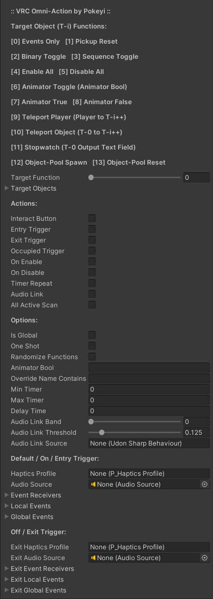

# VRC-Omni-Action
Multi-purpose user-action/event and function-handling component for VRChat.

## Overview
Omni-Action is a single configurable UdonSharp behaviour that can be used for a growing multitude of VRChat world interactions and game-logic functions. It is intended to be efficient and relatively simple to use without the need for any additional editor scripts or dependencies outside of UdonSharp. All configuration including networking and event routing can be done within the Unity Inspector window without the need for any programming, Udon, or SDK knowledge. That said, the source code is cleanly-organized and commented in the hopes of also being a good learning tool, and there are very few limitations imposed on the level of complexity you can achieve.

### Requirements
Errors regarding functions not being exposed likely mean you need an updated version of the SDK or UdonSharp.
- [VRChat Worlds SDK3](https://vrchat.com/home/download) (Tested: v2021.11.8)
- [UdonSharp](https://github.com/MerlinVR/UdonSharp) (Tested: v0.20.3)

### Optional
Components with specific functionality built into the behaviour, should you like to use them.
- [VRC Haptics Profile](https://github.com/Pokeyi/VRC-Haptics-Profile) (Controller Vibration)
- [Udon AudioLink](https://github.com/llealloo/vrc-udon-audio-link) (Audio Data Input)

### Recommended
Other useful VRChat world-creation tools that I will always recommend.
- [World Creator Assistant](https://github.com/Varneon/WorldCreatorAssistant) (SDK & Package Management)
- [CyanEmu](https://github.com/CyanLaser/CyanEmu) (Unity-Window Testing)
- [Udon Platform Hook](https://github.com/Superbstingray/UdonPlayerPlatformHook) (Moving-Platform Functionality)

## Features
The main features of Omni-Action can be broken down into three categories.
- Functions - What activity the behaviour will be performing with its target game objects each time it is activated.
- Actions - *How* the function is activated, be it via direct player interaction or other defined circumstances.
- Options - Additional settings to further customize or add functionality.

All of the following settings have hover-tooltips in the Unity Inspector window.

### Functions
The primary function of the behaviour. Only one can be selected.
- Events Only - No target-object functionality outside of options and event routing (detailed below).
- Pickup Reset - Reset target VRC-Pickup objects to their original positions and rotations from instance start.
- Binary Toggle - Swap current active status of all target objects.
- Sequence Toggle - Enable active status of one target object at a time (disabling all others) in sequence.
- Enable All - Enable active status of all target objects.
- Disable All - Disable active status of all target objects.
- Animator Toggle - Toggle specified boolean variable on target objects' animator components.
- Animator True - Enable specified boolean variable on target objects' animator components.
- Animator False - Disable specified boolean variable on target objects' animator components.
- Teleport Player - Teleport player to the location of the first target object or in sequence if multiple.
- Teleport Object - Teleport first target object to all other target-object locations in sequence.
- Stopwatch - Toggle a stopwatch counter that outputs its accrued time to Text component of first target object.
If using both entry & exit trigger actions, stopwatch will start on exit and stop on re-entry. Otherwise, it will toggle.
- Object-Pool Spawn - Attempt to spawn next object from each target object's VRC-Object-Pool.
- Object-Pool Reset - Reset contents of each target object's VRC-Object-Pool.

### Actions
The means of activation for the target object function. Multiple can be selected.
- Button Interact - Activate when player clicks the button.
- Entry/Exit Trigger - Activate when player or specified pickup object enters/exits trigger.
- Occupied Trigger - Activate when *any* player or specified pickup object enters trigger, deactivate when empty.
- On-Enable/Disable - Activate when object's active status is changed. (See: Known Issues [#1](https://github.com/Pokeyi/VRC-Omni-Action#known-issues))
- Timer Repeat - Activate on a repeated timer, either random range or set interval.
- AudioLink - Activate when Udon AudioLink data meets conditions on specified audio band.
- All-Active Scan - Activate if all target objects found active, deactivate if it becomes untrue. (See: Known Issues [#2](https://github.com/Pokeyi/VRC-Omni-Action#known-issues))
- Remote Action - Activate remotely from another behaviour.

### Options
Additional modifications of functionality. Multiple can be selected.
- Is Global - Behaviour won't explicitly sync objects or serialize variables over the network for other players and late joiners unless this is enabled. (See: Known Issues [#3](https://github.com/Pokeyi/VRC-Omni-Action#known-issues))
- One-Shot - When enabled, the function can only be activated one time. An optional "\_ReEnable" event can be called to reset this.
- Randomize Functions - Add randomization or shuffling to certain functions: Sequence Toggle, Player/Object Teleport, Object-Pool Spawn/Reset.
- Animator Bool - Name of effected boolean variable for relevant animator functions.
- Override Name Contains - Triggers are activated by game objects containing this name *instead* of by players, unless this field is left empty.
- Min/Max Timer - Randomized range in seconds for Timer Repeat action. For a steady interval, set Max Timer to 0 or both fields to same value.
- Delay Time - Delay the final step of functions for a set number of seconds. The delay is observed *after* Audio, Haptics, and Events have been fired.
- AudioLink - Only relevant if you are using [Udon AudioLink](https://github.com/llealloo/vrc-udon-audio-link) data in your project. Threshold adjusts band sensitivity and applied inverse time throttle (<1s).
Threshold is applied independently from source AudioLink's own threshold settings, no source behaviour variables are changed or directly referenced.
- Entry/Exit - Functionality is split for actions that can behave differently whether they are being entered/exited or enabled/disabled, etc.
- Haptics Profile - Reference a [VRC Haptics Profile](https://github.com/Pokeyi/VRC-Haptics-Profile) to relay customized controller vibration to the player.
- Audio Source - Play sound from audio source when the function is activated activated. If 'Is Global' is enabled, all other players within range will hear the sound as well.
- Events - These options enable you to remotely call public methods / custom events on other behaviours. Global events will trigger for all players and are ignored if 'Is Global' is not enabled. Events are called sequentially for the receiver on the same numbered line in the inspector array. If calling both local and global events on different behaviours, leaving an event name blank will skip it for that receiver. As an example, you can trigger remote actions on other Omni-Action behaviours with the "\_RemoteAction" local event. (See: Known Issues [#4](https://github.com/Pokeyi/VRC-Omni-Action#known-issues))

### Use Case Examples
A few of the simpler configurations that are possible.
- Binary Toggle + Interact Button = Mirror Toggle
- Sequence Toggle + Interact Button = Low / High / Transparent Mirror Switcher
- Animator Toggle + Occupied Trigger + 'Is Global' = Proximity Door
- Teleport Player + Entry Trigger = Portal
- Entry Trigger + Exit Trigger + Stopwatch = Time Trial Zone
- Teleport Object + Interact Button + 'Is Global' = Hidden-Item Relocator
- Object-Pool Spawn + Timer Repeat + 'Is Global' = Obstacle Dropper
- Pickup Reset + Interact Button = Yea, these are pretty self-explanatory.

### Known Issues
As stated above, very few limitations are imposed on what configurations can be made, but some combinations won't play well together.
1. Spotty functionality and player-syncing if component is on an object that is subject to having its own active status disabled, for obvious reasons. Maybe just don't do that.
2. All-Active Scan action performs its function on the same target objects it is reacting to, so you should probably choose Events Only for most cases.
3. 'Is Global' should be enabled if you are manipulating target objects that are themselves network-synced or contain networked components like VRC-Object-Sync or VRC-Object-Pool. Non-local actions (On-Enable/Disable, All-Active Scan, AudioLink, Timer Repeat, Occupied Trigger) will appropriately be filtered to only activate once through the network owner when enabled as well.
4. Per the VRChat API, public method/event names starting with an "\_Underscore" are protected from remote network calls, necessitating use of a local-only event.
5. Functionalities involving frame updates and time do not stack and will override each-other by the following priority: All-Active Scan > AudioLink > Timer Repeat > Stopwatch.
6. (BUG) Teleport Object function does nothing on occasion due to being included in the sequence and teleporting to itself. Easy fix for the next release.
7. (TO-DO) Wider functionality for the Randomize option will be added in the next release.

## Credit & Support
Please credit me as Pokeyi if you use my work. I would also love to see your creations that make use of it if you're inclined to share. This and related projects at release have involved over three months of solid work and self-education as I strive for an opportunity to change careers and make a better life for myself. If you find value in my work, please consider supporting me, I appreciate it more than you can imagine!

## License
This work is licensed under the MIT License.

Copyright © 2021 Pokeyi - https://pokeyi.dev - [pokeyi@pm.me](mailto:pokeyi@pm.me)

Permission is hereby granted, free of charge, to any person obtaining a copy
of this software and associated documentation files (the "Software"), to deal
in the Software without restriction, including without limitation the rights
to use, copy, modify, merge, publish, distribute, sublicense, and/or sell
copies of the Software, and to permit persons to whom the Software is
furnished to do so, subject to the following conditions:

The above copyright notice and this permission notice shall be included in all
copies or substantial portions of the Software.

THE SOFTWARE IS PROVIDED "AS IS", WITHOUT WARRANTY OF ANY KIND, EXPRESS OR
IMPLIED, INCLUDING BUT NOT LIMITED TO THE WARRANTIES OF MERCHANTABILITY,
FITNESS FOR A PARTICULAR PURPOSE AND NONINFRINGEMENT. IN NO EVENT SHALL THE
AUTHORS OR COPYRIGHT HOLDERS BE LIABLE FOR ANY CLAIM, DAMAGES OR OTHER
LIABILITY, WHETHER IN AN ACTION OF CONTRACT, TORT OR OTHERWISE, ARISING FROM,
OUT OF OR IN CONNECTION WITH THE SOFTWARE OR THE USE OR OTHER DEALINGS IN THE
SOFTWARE.
